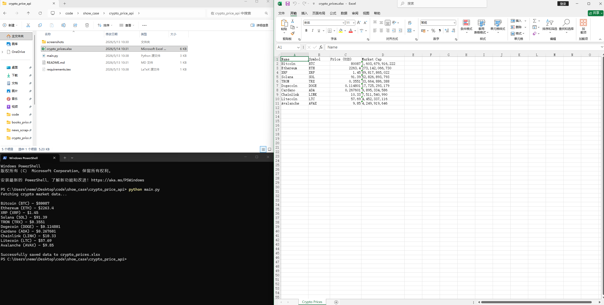
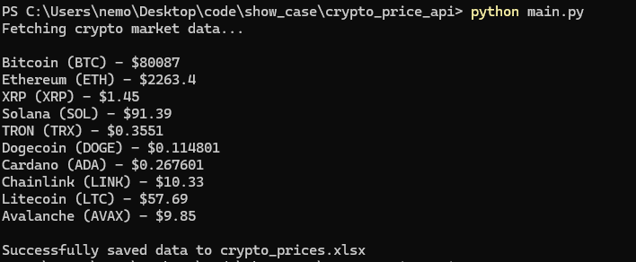
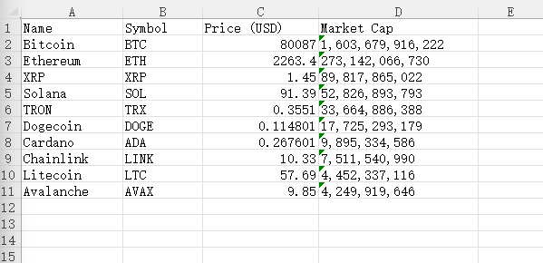
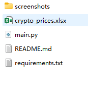
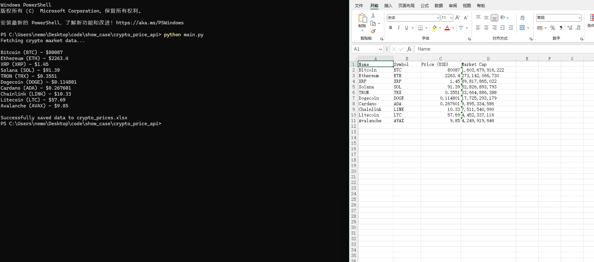

# Crypto Price Tracker



A Python-based cryptocurrency price tracker that fetches real-time market data from the CoinGecko API and exports the results to an Excel file.

## Features

- Fetch real-time cryptocurrency market data
- Track multiple cryptocurrencies including:
  - Bitcoin
  - Ethereum
  - Solana
  - Dogecoin
  - Cardano
  - Ripple
- Export data to Excel (.xlsx)
- Automatically adjust Excel column widths
- Simple and clean terminal output

## Technologies

- Python
- requests
- pandas
- openpyxl

## Installation

```bash
pip install -r requirements.txt
```

## Usage

```bash
python main.py
```

## Output

```bash
crypto_prices.xlsx
```

## Project Structure

```text
crypto-price-tracker/
│
├── main.py
├── requirements.txt
├── README.md
├── crypto_prices.xlsx
└── screenshots/
    ├── preview.png
    ├── 01_terminal_output.png
    ├── 02_excel_export.png
    ├── 03_project_structure.png
    └── 04_program_demo.png
```

## Screenshots

### Terminal Output



### Excel Export



### Project Structure



### Program Demo




## Disclaimer

This project is for educational purposes only.